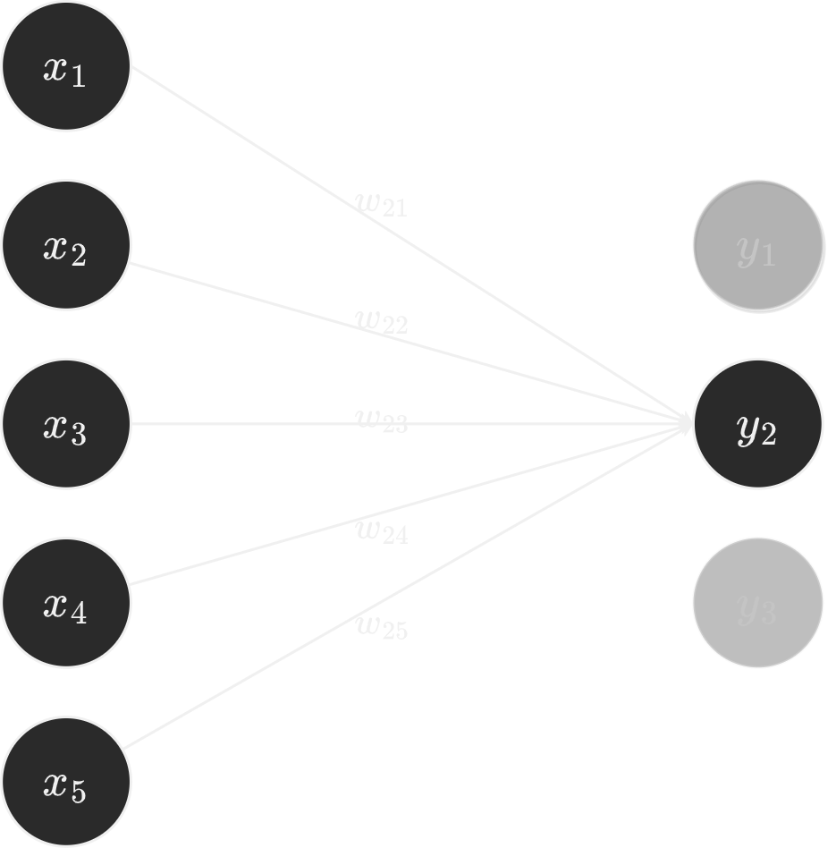
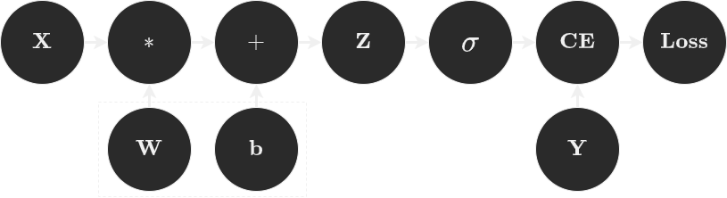

<style>
    
img[alt~="center"] {
  display: block;
  margin: 0 auto;
}

.center-align {
    margin-right: auto !important;
    margin-left: auto !important;
    text-align: center;
}

.right-align {
    text-align: right;
}

.figure-container {
  display: flex;
  justify-content: space-evenly;
  margin: 0 0 0 0;
  padding: 0 0 0 0;
}
</style>

# PyTorch en Acción

**Diego Quezada**
**Machine Learning Engineer**


---

### Acerca de mí

* Ingeniero Civil Informático 2023.
* Estudiante Magíster en Ciencias de la Ingeniería Informática.
* 2+ años de experiencia en la industria.
* ``/diegoquezadac`` en <span style="color: #4895EF">LinkedIn</span>.

---

# 0. Contenido

1. Introducción a PyTorch
2. Fundamentos de PyTorch
3. ``torch.Autograd``
4. ``torch.Optim``
5. PyTorch 2.X
6. Experiencias Prácticas


---
<!-- header: Introducción a PyTorch -->
# 1. Introducción a PyTorch

* Librería de Python *open source* e **imperativa** para aprendizaje profundo.
* Desarrollado por Facebook AI Research (FAIR) en el 2017.
* Basado en [Torch](http://torch.ch): un framework para computación científica escrito en Lua.

---

## 1.1. Principios de diseño

* Ser <span style="color: #4895EF">Pythonic</span>.
* Poner a los investigadores primero.
* Proveer **desempeño pragmático**.

---

## 1.2. Diseño centrado en la usabilidad:

* *Everything is just a program*.
* Interoperabilidad y extensiblidad.
* Diferenciación automática.

---


<!-- header: Fundamentos de PyTorch -->
# 2. Fundamentos de PyTorch


* ``Tensor``: Matriz multi-dimensional que contiene elementos de un **único** tipo de datos.
* ``Dataset``: Colección de datos.
* ``DataLoader``: Iterador que permite cargar datos de un ``Dataset``.
* ``nn.Module``: Clase base para todos los módulos de red neuronal.

---
<!-- header: Tensor -->
## 2.1. Tensor

* Los tensores son la estructura de datos principal de PyTorch.
* En el contexto del aprendizaje automático, los tensores son utilizados para almacenar y manipular datos, así como los parámetros de los modelos.
* <span style="color: #FF6F61">torch.Tensor</span> permite cálculos eficientes y flexibles, integración con <span style="color: #4895EF">NumPy</span>, optimización en GPU y manipulación intuitiva.

---
<!-- header: Tensor -->
```python
A = torch.tensor([[1,2,3], [4,5,6], [7,8,9]])
B = torch.zeros(3, 3)
C = torch.randn(3, 3)
D = torch.eye(3)

print(f"Shape of tensor: {A.shape}")
print(f"Datatype of tensor: {A.dtype}")
print(f"Device tensor is stored on: {A.device}")
```

---
<!-- header: Dataset -->
## 2.2. Dataset

* Los conjuntos de datos son esenciales en el aprendizaje automático.
* Requieren una estructura flexible para su definición.
* La clase <span style="color: #FF6F61">torch.utils.data.Dataset</span> ofrece una interfaz estandarizada para esta definición.

---

```python
class TestDataset(Dataset):

    def __init__(self):
        self.data = torch.randn(10_000, 5)
        self.target = torch.randint(0, 2, (10_000,3))


    def __getitem__(self, index: int):
        x = self.data[index]
        y = self.target[index]
        return x, y

    def __len__(self):
        return len(self.data)   
```

---
<!-- header: DataLoader -->
## 2.3. DataLoader

* Iterar a través del conjunto de datos es una práctica común en el proceso de entrenamiento.
* Manejar grandes conjuntos de datos presenta el desafío de una gestión eficiente de la memoria y los recursos del sistema.
* <span style="color: #FF6F61">torch.utils.data.DataLoader</span> permite cargar conjuntos de datos eficientemente en *batches*.

---

```python
dataloader = DataLoader(dataset, batch_size=64, shuffle=True) 

for index, (x, y) in enumerate(dataloader):

    print(f'Batch {index}: {y}')
```

---
<!-- header: nn.Module -->
## 2.4. nn.Module

* Controlar la arquitectura de los modelos es crucial para adaptarlos a tareas específicas y mejorar su rendimiento.
* El rápido avance en deep learning demanda una estructura flexible y escalable para la implementación de modelos.
* <span style="color: #FF6F61">nn.Module</span> permite implementar modelos de manera imperativa, brindando flexibilidad y control sobre cada componente del modelo en PyTorch.

---
```python
class Net(nn.Module):
    def __init__(self):
        super(Net, self).__init__()
        self.input_layer = nn.Sequential(nn.Linear(5, 32), nn.ReLU())
        self.hidden_layer = nn.Sequential(nn.Linear(32, 32), nn.ReLU())
        self.output_layer = nn.Sequential(nn.Linear(32, 3), nn.Sigmoid())

    def forward(self, x):
        x = self.input_layer(x)
        x = self.hidden_layer(x)
        x = self.output_layer(x)
        return x
```

---
<!-- header: torch.Autograd -->
# 3. torch.Autograd

- El objetivo del aprendizaje automático es minimizar una función de costo $J(\bm{\theta})$.
- Al utilizar gradiente descendente, es necesario calcular $\nabla J(\bm{\theta})$.
- <span style="color: #FF6F61">torch.autograd</span> permite calcular gradientes automáticamente.

---
<!-- header: torch.Optim -->
# 4. torch.Optim

- Una vez calculado $\nabla J(\bm{\theta})$, es necesario actualizar los parámetros del modelo.
- <span style="color: #FF6F61">torch.optim</span> implementa métodos de optimización populares como SGD y Adam.
- <span style="color: #FF6F61">torch.optim.lr_scheduler</span> ofrece varios métodos para ajustar la tasa de aprendizaje.

---


---
```python
X = torch.randn(64, 5)  # Batch (64) x Features (5)
Y = torch.ones(64, 3)  # Batch (64) x Classes (3)

W = torch.randn(5, 3, requires_grad=True)
b = torch.randn(3, requires_grad=True)

optimizer = torch.optim.SGD([W, b], lr=0.1)
````

```python
optimizer.zero_grad()

Z = torch.matmul(X, W) + b # Forward pass

loss = torch.nn.functional.binary_cross_entropy_with_logits(Z, Y)

loss.backward() # Backward pass
optimizer.step()
```
---



---
<!-- header: PyTorch 2.2 -->
# 5. PyTorch 2.X

* PyTorch 2.0 introdujo ``torch.compile`` y el backend MPS para Apple M1/M2.
* PyTorch 2.1 introdujo múltiples mejoras a ``torch.compile``, entre ellas, la capacidad de compilar operaciones en NumPy.
* PyTorch 2.2 expandió el soporte de ``torch.compile`` a optimizadores.

---
<!-- header: Experiencias Prácticas -->
# 6. Experiencias Prácticas